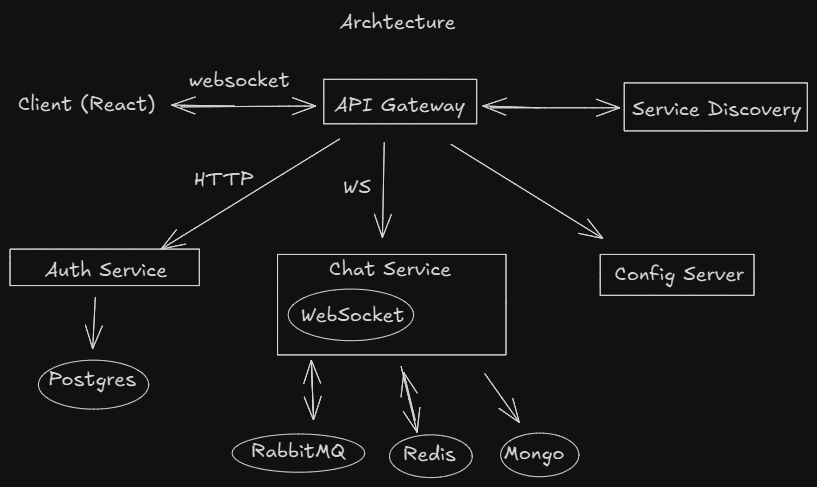

## Arquitetura 

Componentes principais (serviços + infra):
1. **Service Discovery** — _Eureka (Spring Cloud Netflix Eureka)_
2. **Config Server** — _Spring Cloud Config Server_
3. **API Gateway** — _Spring Cloud Gateway_ (faz roteamento HTTP + WebSocket proxy)
4. **Auth & User Service** (unificado) — _Spring Boot + PostgreSQL_ (autenticação/usuário/profile)
5. **Chat Service** — _Spring Boot_ (WebSocket endpoint, lógica de salas, persistência em MongoDB)
6. **Message Broker** — _RabbitMQ_ (fila / exchange para entregar messages entre instâncias e serviços)
7. **Cache** — _Redis_ (sessões leves, presença, metadados de sala, TTLs)
8. **Bancos de dados** — PostgreSQL (Auth/User), MongoDB (Chat: mensagens/rooms)
9. **Observability (opcional)** — logs centralizados + métricas (Prometheus/Grafana) — opicional para demonstrar boas práticas.

### Por que cada serviço / papel
1. **API Gateway**
	- Função: Ponto de entrada único para clientes — roteia requisições REST e faz upgrade para WebSocket (proxy). Também centraliza TLS, rate limiting, CORS, e validação básica do JWT.
	- Justificativa: Em microsserviços é padrão ter um gateway para reduzir a exposição direta dos serviços e oferecer cross-cutting concerns (autenticação, logging, roteamento). Mantemos a lógica no gateway mínima (não colocar regras de negócio).
2. **Service Discovery (Eureka)**
	- Função: Permite que serviços encontrem uns aos outros dinamicamente (nome -> instância). O gateway e serviços se registram no Eureka.
	- Justificativa: Ajuda a escalar serviços (múltiplas instâncias do Chat Service), e é um padrão clássico do ecossistema Spring Cloud. Para um portfólio, demonstra que você conhece service discovery.
3. **Config Server**
	- Função: Centraliza configurações (profiles, secrets leves) para todos os serviços.
	- Justificativa: Mostra prática de configuração centralizada e gestão de ambientes (dev/staging/prod). Mantém serviços com menos config hard-coded.
4. **Auth & User Service**
	- Função: Cadastro/login, emissão de JWT, gerenciamento de perfis, validação de autorização. Persiste usuários em PostgreSQL.
	- Justificativa: Separar identidade é uma boa prática. Para manter o projeto enxuto, unificamos auth e user em um único serviço — suficiente para demonstrar padrões de segurança (JWT, refresh tokens, roles).
5. **Chat Service**
	- Função: Lógica de salas, conexão WebSocket (STOMP ou protocolo simples), persistência de mensagens em MongoDB, publicação/assinatura via RabbitMQ para entregar mensagens entre instâncias. Mantém estado efêmero no Redis (por ex. presença, sessões).
	- Justificativa: Chat é o núcleo: precisa lidar com conexões em tempo real e persistência. MongoDB é natural para mensagens (document model flexível). RabbitMQ garante entrega entre instâncias (pub/sub) e desacopla produtores/consumidores.
6. **RabbitMQ (mensageria)**
	- Função: Roteia mensagens (exchanges/queues). Ex.: quando um usuário envia mensagem, Chat Service publica na exchange; instâncias interessadas consomem e entregam aos sockets locais.
	- Justificativa: Garante escalabilidade horizontal — se eu tiver 3 instâncias do Chat Service, cada uma consome apenas as messages que precisa entregar aos seus clientes. Também permite integrações futuras (notificações push, arquivamento).
7. **Redis (cache & presença)**
	- Função: Cache de metadados (ultimas mensagens, lista de participantes, presença com TTL), locks leves.
	- Justificativa: Acesso rápido e TTL útil para presença (se o socket cair sem aviso). Evita leituras frequentes no MongoDB para dados voláteis.
### Definição de portas 

| Serviço/Banco | Nº porta        |
| ------------- | --------------- |
| Gateway       | 8080            |
| Auth          | 8083            |
| Chat          | 8082            |
| Discovery     | 8084            |
| Config        | 8085            |
| PostgreSQL    | 5432 (default)  |
| Mongo         | 27017 (defautl) |
| Mongo-Express | 8081 (default)  |
| RabbitMQ      | 5672 (default)  |
| Frontend      | 3000            |

### **Endpoints principais por serviço**

#### 🔐 Auth Service

|Método|Endpoint|Descrição|
|---|---|---|
|`POST`|`/auth/register`|Registrar novo usuário|
|`POST`|`/auth/login`|Autenticar usuário e gerar JWT|
|`GET`|`/auth/validate`|Validar token JWT (usado pelo gateway)|
|`GET`|`/auth/me`|Retornar informações do usuário autenticado|

---
#### 💬 Chat Service

|Tipo|Endpoint|Descrição|
|---|---|---|
|`WS`|`/ws/chat`|Conectar-se ao chat (envia JWT no handshake)|
|`GET`|`/chat/messages/{roomId}`|Buscar histórico de mensagens|
|`POST`|`/chat/rooms`|Criar nova sala de chat|
|`GET`|`/chat/rooms`|Listar salas disponíveis|
|`GET`|`/chat/rooms/{roomId}/users`|Listar usuários conectados em uma sala|
|`GET`|`/chat/health`|Health-check do serviço|

---
#### 🚪 API Gateway (Roteamento)

|Rota|Encaminha para|Observações|
|---|---|---|
|`/auth/**`|Auth Service|Login, registro, validação|
|`/chat/**`|Chat Service|REST do chat|
|`/ws/**`|Chat Service|Proxy de WebSocket|
|`/actuator/**`|Todos (restrito)|Monitoramento|

---
# Fluxos / casos de uso (sequências) — passo a passo

## Caso 1 — Conexão & Autenticação (cliente abre app)

1. Cliente (React) pede token ao **Auth Service** via HTTP (username/password).
    - Auth valida credenciais no PostgreSQL e retorna **JWT** (+ refresh token opcional).
    - Por que: separar credenciais e emitir JWT evita enviar senha repetidamente.
2. Cliente abre WebSocket para o **API Gateway**: `wss://gateway.example.com/ws?token=JWT`.
    - Gateway valida JWT (pode delegar para Auth Service se quiser) — tipicamente valida localmente (public key) para desempenho.
    - Gateway encaminha (proxy) a conexão WebSocket para uma instância do **Chat Service** (resolver via Eureka).
    - Por que: Gateway atua como entrypoint e autentica antes de rotear.
3. **Chat Service** aceita o socket, cria sessão em memória / registra sessão no Redis (com TTL) e marca presença (ex.: `presence:{userId}:online = instanceId`).
    - Também pode publicar um evento `user.connected` no RabbitMQ se outras partes precisam saber.
    - Por que: Chat Service gerencia sockets e presença localmente, e publica eventos para consistência global.
---
## Caso 2 — Entrar em sala (join room)

1. Cliente envia via WebSocket uma mensagem tipo `JOIN roomId` para a instância local do Chat Service.
2. Chat Service valida se o usuário pode entrar (roles, ban, etc.) — pode consultar Auth Service se precisa de checagem extra.
3. Chat Service adiciona usuário à lista de participantes da sala no Redis (`room:{roomId}:members`).
4. Se necessário, Chat Service publica evento `room.member.joined` no RabbitMQ para outras instâncias se atualizarem (ou para histórico).
5. Chat Service retorna confirmação ao cliente e, opcionalmente, envia últimas N mensagens carregadas do MongoDB (cache pode servir se disponível).
- Por que: usar Redis para membros evita leituras no Mongo e permite baixo-latency para operações de presença; mensagens antigas ficam em Mongo para persistência.

---
## Caso 3 — Enviar mensagem

1. Usuário envia `SEND {roomId, content, metadata}` via WebSocket para a instância local do Chat Service.
2. Chat Service faz validações (antispam, length, etc.), persiste a mensagem **assíncronamente** em MongoDB (inserção) e publica o evento `message.sent` na exchange do RabbitMQ (padrão: exchange por sala ou por tópico).
	- Persistência e publish podem ser em paralelo: publica evento imediatamente (low-latency), grava no banco em background; mas idealmente garantir persistência antes de confirmar ao cliente (trade-off). Para portfólio: gravar primeiro (consistência) é mais simples de explicar.
3. Todas as instâncias do Chat Service interessadas nessa sala consomem a mensagem do RabbitMQ; cada instância entrega a mensagem via WebSocket aos clientes conectados a ela que estejam na sala.
4. O Chat Service que originou a mensagem também entrega localmente (shortcut) para reduzir latência.
5. Se o usuário estiver offline, o evento pode fazer outro serviço (ou a mesma instância) armazenar notificação para entrega futura (push/email) — opcional.
- Por que: RabbitMQ desacopla envio e entrega, permite escalar instâncias do Chat Service sem perder mensagens.

---
## Caso 4 — Desconexão / presença

1. Socket fecha: Chat Service remove sessão (ou marca offline) e atualiza Redis (remove `room:{roomId}:members` entry) e publica `user.disconnected`.
2. Outros participantes podem receber evento de presença via RabbitMQ (ou consulta a Redis).
3. Redis TTL ajuda a recuperar de desconexões abruptas (se conexão cair sem close, TTL expira e outros detectam offline).
- Por que: presença precisa ser rápida e eventual-consistente; Redis com TTL é prático.

---
## Estrutura do código atual
### Chat Service

```markdown
chat/
 ├─ controller/
 │   └─ ChatController.java
 ├─ service/
 │   ├─ ChatService.java
 │   └─ MessageService.java
 ├─ dto/
 │   ├─ ChatMessageDTO.java
 │   ├─ UserNotificationDTO.java
 │   └─ UserNotificationResponseDTO.java
 ├─ model/
 │   ├─ Message.java
 │   └─ Room.java
 ├─ websocket/
 │   ├─ WebSocketConfig.java
 │   ├─ UserHandshakeInterceptor.java
 └─ repository/
     ├─ MessageRepository.java
     └─ RoomRepository.java
```

> Os projetos dos demais serviços ainda não foram iniciados
## Funcionalidades básicas do usuário
- Registro e Login (Autenticação e autorização com token JWT)
- Criar salas
- Entrar e sair de salas
- Enviar mensagem públicas em salas e enviar mensagens privadas para outro usuário
- Listar salas
- Listar usuarios de uma sala
- Retornar histórico de mensagens